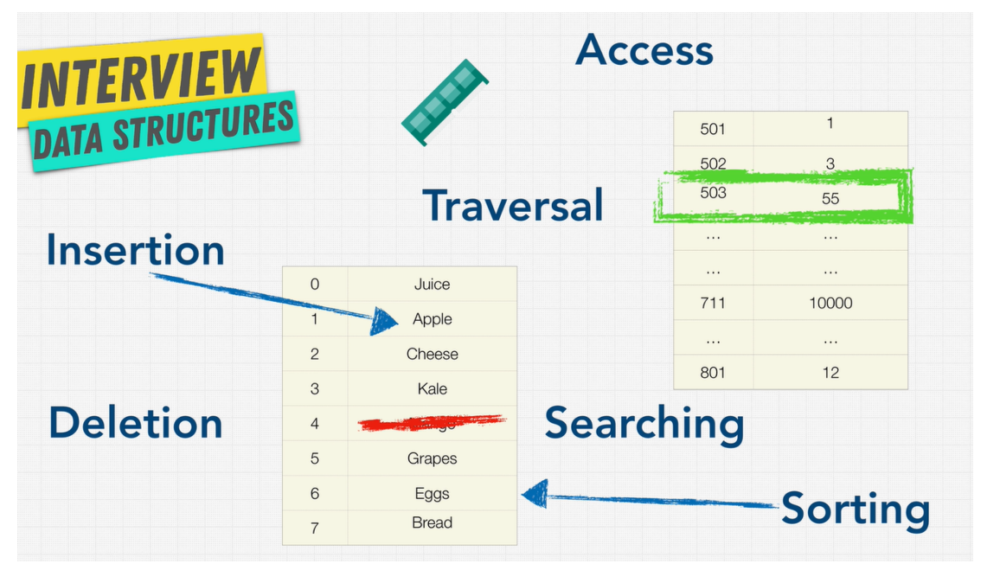

# Data Structure

Data Structure is a storage that is used to store and organize data. It is a way of arranging data in the computer memory so that it can be accessed and updated efficienctly. Each Data Structure is Good and is specialized for it's own thing.

## Operations on Data Structures

1. Insertion.
2. Deletion.
3. Traversal.
4. Searching.
5. Sorting.
6. Access.

# Index of Topics to be aware of

1. Time Complexity
2. Space Complexity

# Basic Language Syntaxes

1. Data Types
2. Basic Input/Output
3. Operators
4. Loops
5. Conditional Statements
6. Switch Statements
7. Functions 
8. Libraries
9. Pointers (if available in Language) 

# Algorithms and Data Structures

1. Array

2. String

3. Linked List

  